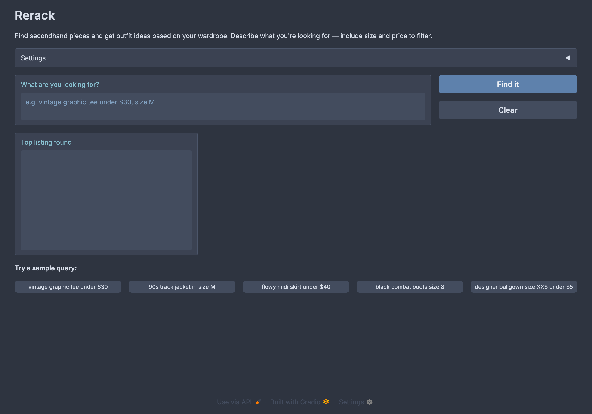
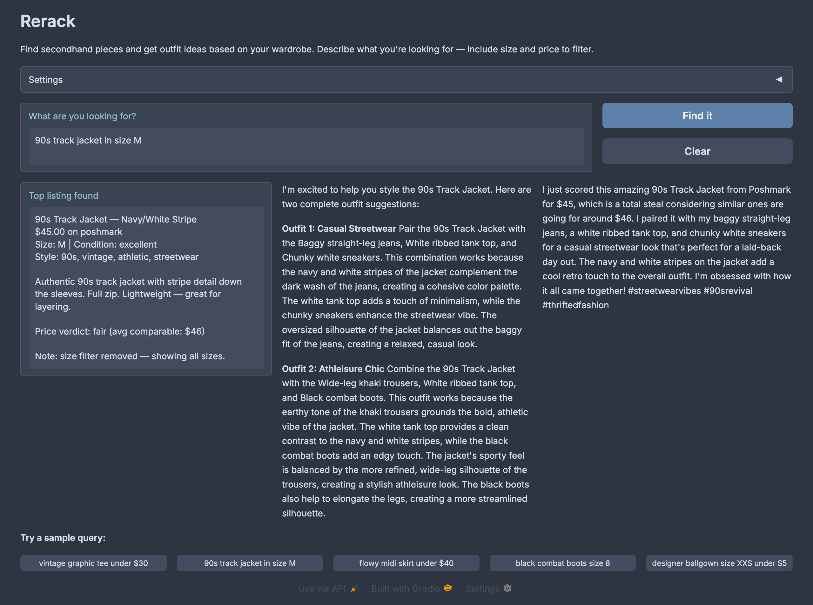

<div align="center">

# Rerack

**AI-powered secondhand clothing finder that searches listings, checks prices, and builds outfit ideas from your wardrobe.**

[](LICENSE)
[](https://github.com/asrarsyed/rerack/actions/workflows/tests.yml)


</div>

---

## Demo




Describe what you want in plain English. Rerack searches a mock listings dataset, compares prices against similar items, suggests an outfit from your wardrobe, and writes a shareable caption.

## About

Rerack is a small agent that plans and executes a fixed sequence of tool calls instead of letting an LLM decide what to do next at each step. Given a query like "vintage graphic tee under $30, size M," it parses the request with regex, searches a mock dataset, retries with loosened constraints if nothing matches, benchmarks the price against comparable listings, and calls an LLM twice: once for outfit ideas, once for a caption.

**Why I built this:** to practice designing a deterministic multi-tool agent loop with explicit state management and real error handling, rather than a single prompt-and-hope chat wrapper.

### Built With

- [Python](https://www.python.org/)
- [Groq](https://groq.com/) (`llama-3.3-70b-versatile`)
- [Gradio](https://www.gradio.app/)
- [pytest](https://pytest.org/)

## Features

- **search_listings**: keyword and filter search over 100 mock listings, scored by token overlap.
- **retry_search**: progressively loosens size and price filters when a search comes up empty.
- **compare_prices**: benchmarks an item's price against comparable listings in the same category.
- **suggest_outfit**: LLM-generated outfit ideas, tailored to the user's wardrobe when one exists.
- **create_fit_card**: LLM-generated shareable caption with price context and hashtags.

See [docs/ARCHITECTURE.md](docs/ARCHITECTURE.md) for the pipeline diagram, tool details, and state management.

## Getting Started

### Prerequisites

```bash
python >= 3.10
```

A free Groq API key from [console.groq.com](https://console.groq.com).

### Installation

```bash
git clone git@github.com:asrarsyed/rerack.git
cd rerack
pip install -e ".[dev]"
cp .env.example .env
# then edit .env and set GROQ_API_KEY
```

### Run

```bash
python app.py
```

Open the URL printed in the terminal, usually `http://localhost:7860`.

### Test

```bash
pytest
```

Tests mock the Groq client, so no API key is needed to run the suite.

## Usage

Example query: "vintage graphic tee under $30, size M."

1. The parser extracts `description="vintage graphic tee"`, `size="M"`, `max_price=30.0`.
2. `search_listings` returns matches sorted by relevance, then price.
3. `compare_prices` checks the top result against similar listings and returns a verdict.
4. `suggest_outfit` asks the LLM for outfit ideas built around the item.
5. `create_fit_card` writes a caption combining the item, the outfit, and the price verdict.

```python
from agent import run_agent
from utils.data_loader import get_example_wardrobe

session = run_agent(
    query="vintage graphic tee under $30, size M",
    wardrobe=get_example_wardrobe(),
)
print(session["fit_card"])
```

## What I Learned

- Items found through the retry path need price context just as much as items found on the first search, so `compare_prices` runs on both paths rather than only the happy path.
- Mocking the Groq client at a single seam (`_get_groq_client`) keeps the test suite fast and deterministic without touching the actual prompt logic, and means CI never needs a live API key.

## Roadmap

- [x] Five-tool planning loop with deterministic control flow
- [x] Retry logic with progressive constraint loosening
- [ ] Swap mock listings for a one-time scraped dataset (with LLM-derived style tags)
- [ ] Multi-turn conversation memory across queries

## Acknowledgments

- [Codepath](https://github.com/jamjamgobambam/ai201-project2-fitfindr-starter), the original starter template
- [Groq](https://groq.com/) for fast LLM inference
- [Gradio](https://www.gradio.app/) for the UI framework
